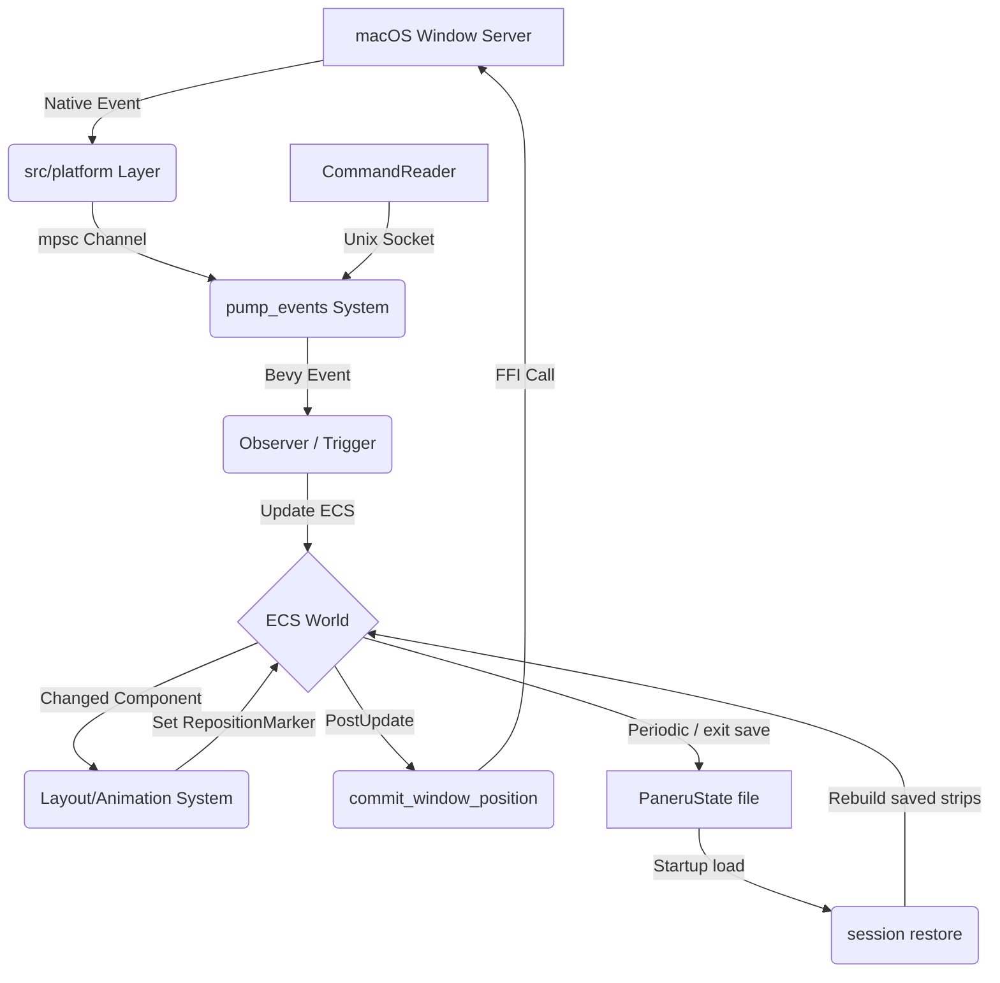

# Paneru Architecture

This document provides a high-level overview of Paneru's architecture for contributors. Paneru is a macOS window manager built using the **Bevy Game Engine** and its **Entity Component System (ECS)**.

## 1. High-Level Overview

Paneru manages macOS windows as a **sliding strip** (inspired by Niri and PaperWM). The core design philosophy is **Data-Driven/ECS**: instead of managing windows as complex objects with internal state, we represent the "World" as a collection of simple data components (Windows, Displays, Workspaces) that are processed by systems.

The primary problem Paneru solves is providing a predictable, stable, and ergonomic tiling experience on macOS. By using Bevy's ECS, we gain:
- **Declarative Logic:** Systems react to changes in window properties (e.g., `Changed<Position>`).
- **High Performance:** Parallel system execution and efficient change detection.
- **Modularity:** Functionality is divided into decoupled plugins and systems.

## 2. The Bevy Bridge

Bevy is typically used for games, so Paneru implements a custom bridge to interact with the macOS Window Server.

### Event Ingestion (macOS -> ECS)
1.  **Platform Layer:** `src/platform/` uses `objc2` and AppKit to interface with macOS. It runs a native event loop or hooks into OS notifications.
2.  **Event Channel:** macOS events (mouse moves, window creations, space changes) are sent via a thread-safe `mpsc` channel.
3.  **Pump System:** The `pump_events` system (in `src/ecs/systems.rs`) reads from this channel during the `PreUpdate` phase and writes Bevy `Message`s or triggers `Observer`s.
4.  **Observers:** Bevy Observers (primarily in `src/ecs/triggers.rs`, with focused domains such as session restore in `src/ecs/restore.rs`) react to these events to update the ECS World (e.g., spawning new `Window` entities or updating `FocusedMarker`).

### State Synchronization (ECS -> macOS)
1.  **Systems:** Bevy systems (like `layout::position_layout_windows`) calculate the intended positions and sizes of windows based on the tiling logic.
2.  **Commit Systems:** In the `PostUpdate` phase, specialized systems like `commit_window_position` and `commit_window_size` identify windows that need updating.
3.  **FFI Calls:** These systems call methods on the `Window` trait object (implemented by `WindowOS` in `src/manager/windows.rs`), which performs the actual accessibility API calls to move or resize the physical macOS window.

**Note:** All AppKit/Accessibility calls must happen on the **Main Thread**. Paneru ensures this by using `NonSend` resources and executing critical synchronization systems on the main thread.

### The Lua Worker (optional `lua` feature)

The embedded scripting runtime is the one deliberate exception to "everything interesting happens on the main thread". A handler is arbitrary user code of unbounded duration, and `pump_events` is itself main-thread-pinned, so running handlers inline meant a slow script stalled the frame clock. `src/lua/worker.rs` runs the interpreter on a dedicated thread instead:

- **Main → worker:** `dispatch_lua_events` and `command_lua_handler` extract plain data (`LuaEvent`, `StateSnapshot`) out of the world and send it over an unbounded channel, attaching the frame's `BatchSnapshot` (query documents, layout tree, script store) so handlers read the world synchronously out of the message. Neither ever blocks.
- **Worker → main:** `drain_lua_outbox` non-blockingly drains queued `Command`s and flash messages onto the command bus, one frame behind; script-state writes go through a narrow ack channel (`StoreWrite`) so `paneru.state.mutate` keeps its compare-and-set semantics.
- **No live queries:** `paneru.query*` reads the attached snapshot, never the live world. Shutdown drops the request queue, which unblocks any waiting writer with an error rather than a hang.

This is what keeps `src/lua/runtime.rs` free of any `bevy` import: it reaches the world only through an `extract` callback, which on the main thread is a direct query and on the worker is that round-trip.

## 3. Crate & Module Map

| Directory / Module | Responsibility Statement |
| :--- | :--- |
| `src/ecs/layout.rs` | Tiling algorithms, column management, and coordinate calculations. |
| `src/ecs/systems.rs` | Bevy systems for lifecycle management, event pumping, and state syncing. |
| `src/ecs/params.rs` | High-level Bevy `SystemParam` abstractions for querying the World. |
| `src/ecs/triggers.rs` | Reactive event handlers (Observers) for OS and internal events. |
| `src/ecs/restore.rs` | Startup session restore planning and application, including window matching, layout rebuilding, and restore grace-period handling. |
| `src/ecs/workspace.rs` | Management of virtual workspaces, display changes, and window movement between spaces. |
| `src/ecs/scroll.rs` | Input handling for trackpad swipe gestures, inertia, and snapping. |
| `src/ecs/focus.rs` | Focus management logic, including focus-follows-mouse and mouse-follows-focus. |
| `src/ecs/state.rs` | Persistence of window layout and workspace state across restarts. |
| `src/manager/` | OS-agnostic traits (`WindowApi`, `ProcessApi`) and their macOS implementations (`WindowOS`). |
| `src/platform/` | Low-level macOS FFI, event loop integration, and workspace/input hooks. |
| `src/config/` | Configuration parsing, validation, and hot-reloading logic. |
| `src/commands.rs` | Implementation of CLI subcommands. |
| `src/client.rs` | The CLI side of the IPC protocol, and the only place JSON is produced. |
| `src/reader.rs` | The daemon side: owns the Mach service and turns requests into events. |
| `crates/mach_ipc` | Typed channels over Mach ports; the transport itself. Async and blocking spellings of each operation, on `SendPort`/`RecvPort`. |
| `src/overlay.rs` | Logic for drawing active window borders and inactive window dimming. |

## 4. Key Data Entities

### Components
- **`Window`:** A wrapper around a macOS window handle (AXUIElement).
- **`Display`:** Represents a physical monitor and its bounds.
- **`LayoutStrip`:** A component attached to a Workspace/Display that manages the ordered list of `Column`s.
- **`LayoutPosition` / `Position`:** The intended (layout) vs. actual (on-screen) coordinates.
- **`Bounds` / `WidthRatio`:** The size of the window and its relative width in the tiling strip.
- **`FocusedMarker`:** Identifies the currently focused window.
- **`ActiveWorkspaceMarker`**: Identifies the currently active workspace.
- **`SelectedVirtualMarker`**: Marks a virtual workspace that is currently selected by the user.
- **`NativeFullscreenMarker`**: Marks a window that is in macOS native fullscreen mode.
- **`Unmanaged`:** An enum identifying windows that are `Floating`, `Minimized`, or `Hidden`.
- **`RepositionMarker` / `ResizeMarker`**: Used to signal that a window needs to be moved or resized.

### Resources
- **`WindowManager`:** A wrapper for the global window management state and OS bridge.
- **`Config`:** The current user configuration.
- **`PaneruState`**: The durable snapshot of managed layout, display, native workspace, and virtual workspace state used for recovery after restarts.
- **`SessionRestore`**: A short-lived startup resource that keeps loaded state and restore timing active until the startup grace period expires.
- **`MissionControlActive`:** A flag indicating if macOS Mission Control is visible (disabling tiling).
- **`FocusFollowsMouse`:** Tracks which window should gain focus based on mouse position.

## 5. Architectural Invariants

- **Main Thread Only:** Any interaction with `objc2`, `AppKit`, or `Accessibility` APIs **must** occur on the main thread.
- **ECS as Source of Truth:** Tiling logic must operate on ECS components (`WidthRatio`, `LayoutStrip`). The physical macOS window state should be a reflection of the ECS state, not the other way around.
- **Pure Layout:** Layout math (in `layout.rs`) should remain as pure as possible, operating on coordinates and ratios rather than directly calling OS APIs.
- **Bounded Restore:** Saved session state is only consulted during startup restore. After `SessionRestore` expires, normal config and window-rule placement owns newly discovered windows.
- **Reactive Power Saving:** Systems should use Bevy's reactive scheduling to avoid CPU usage when no windows are moving or events are occurring.
- **Quiet-Frame Quiescence:** A settled world holds no flight markers (`RepositionMarker`), scroll state (`Scrolling`), held gestures (`MouseHeldMarker`), animating drives, or live homing graces — see `test_settled_world_is_quiescent`. Quiet frames do no work because nothing is flagged. The Swift port preserves this by construction (lexical pass order, explicit dirty flags) rather than by scan.

## 5b. Target Synchronous Pipeline (Swift Port)

The Bevy schedules stay until cutover, but new logic must fit the explicit
pass list below so the port is mechanical. Each pass has one owner and runs
in lexical order — `ingest → layout → commit → paint` — instead of emergent
`Changed/Added` gating:

| Pass | Today (reactive) | Target (explicit) |
| :--- | :--- | :--- |
| Ingest | `pump_events` + `demux_input_events` + tap WS observers | Drain tap-shim ring + Mach queue into one event vec |
| Layout | `register_systems` `Update` chain keyed on `Changed<Position/Bounds>` | `LayoutStrip` recompute behind a `layout_dirty` flag set at mutation sites |
| Commit | `commit_window_position/size` on `CommittedWindows` (`Or<Changed…>`) | Per-window `target/lastSent` compare in the AX actor's coalescing inbox |
| Paint | Overlay gate's 8 `or_eager` terms (`vw_indicator_dirty`, `overlay_tracking_motion`, `bordered_set_changed`, `any_window_animating`, `drag_ended`, `mission_control_changed`, `display_set_changed`, `snapshot_advanced` in `ecs.rs`) | Explicit `paint_dirty` set by commit/focus/drag/mission-control/display/snapshot owners |
| Queries | `serve_lua_store` + per-pass extraction | Per-frame `BatchSnapshot` attached to the worker message |

`FrameActivity::mid_frame` (7 queries) collapses to the same dirty flags.
No new `Changed`/`Added`/`RemovedComponents` run conditions: if a change can
happen, its owner sets the flag.

## 6. Session Restore

`src/ecs/state.rs` extracts and persists the restart snapshot. The state file is
written atomically to `paneru/state.json` in the XDG state directory
(`~/.local/state/paneru/state.json` on a default macOS setup) and is loaded
during Bevy app setup.

`src/ecs/restore.rs` owns startup restore. It keeps the loaded `PaneruState`
alive in `SessionRestore` for the configured grace period so applications have
time to reopen their windows. As windows arrive, `restore_window_state` builds a
restore plan from the saved state and the currently managed ECS windows.

Window matching prefers stable identity (`window_id`, `pid`, and `bundle_id`)
and uses the conservative fallback identity only when it can do so
unambiguously. The fallback includes `bundle_id`, window title when available,
window identifier, role, and subrole. Saved windows that are missing at startup
are ignored by default, and the restored layout is compacted around the matched
windows.

Restore rebuilds `LayoutStrip`s, virtual workspace rows, selected virtual
workspace markers, and display associations. When the current macOS workspace
to display mapping conflicts with saved display data, the current mapping is
preferred; otherwise restore falls back to the saved display, then the active
display, then any available display. Matched startup windows skip static
`[windows]` placement so the saved session wins, while unmatched windows and
post-grace windows follow normal config behavior.

## 7. Data Flow Diagram

## 8. Swift Port (`swift-daemon/`)

The native port grows slice by slice alongside the Rust daemon, which ships
until cutover:

- **`Geometry`** (done): the single home for pure rect math — `round_px`,
  viewport clamps, `origin_exposing`, CG↔Cocoa conversion, border rects,
  drop-preview rects — ported verbatim from `util.rs`, `manager.rs`,
  `ecs/layout.rs`, `ecs/mouse.rs`, and `overlay.rs`, with parity checks in
  `Tests/GeometryTests` (`swift run --package-path swift-daemon
  GeometryChecks`). New pure geometry goes here, not in a fifth Rust site.
- **`Layout`** (done): ECS-free `LayoutStrip`/`Column`/`StackItem` model plus
  `binpackHeights`/`mostVisibleWindow`, ported verbatim from
  `src/ecs/layout.rs` (verified by `Tests/LayoutTests`: `swift run
  --package-path swift-daemon LayoutChecks`). Frame-supplying passes
  (`relative_positions`, `desired_window_frame`) stay in Rust until the
  window-frame provider ports.
- **`CTapShim`** (done): real-time `CGEventTap` sidecar in C (SPSC ring +
  translator + callback). No Swift runs at tap priority; the daemon drains
  the ring on the main thread. Unit-tested without permissions (see
  `Tests/TapShimCTests`).
- **`AXClient`** (done): commit/read discipline port — `AXWriteState`
  (sequence/epoch tracking, whole-frame convergence, stuck-writer watchdog
  ladder, send dedup), drain coalescing (latest-per-window merge, priority
  order), and the read tracker's cache/inflight/completed protocol with an
  injectable clock — ported verbatim from `src/ax_writer.rs` and
  `src/ax_reads.rs` (verified by `Tests/AXClientChecks`: `swift run
  --package-path swift-daemon AXClientChecks`). Actual AX calls stay behind
  protocols; threading becomes an actor at integration time.
- **`EventCore`** (done): lexical pass order (`ingest → layout → commit →
  paint`), `DirtyFlags`, pump cadence, and scheduling predicates
  (`adoptionDistrusted`, `overlayTracksLive`, `driveTrust`), ported verbatim
  from `src/ecs/systems.rs` (verified by `Tests/EventCoreChecks`).
- **`Presentation`** (done): AppKit-free overlay decisions — border sync
  plans (O(changed) routing), 0.5px rest equality, dim equality, flash
  sizing/buckets/dedup — from `src/overlay.rs` and
  `overlay-swift/Flash.swift` (verified by `Tests/PresentationChecks`).
  Menubar rendering stays out (needs live AppKit).
- **`Scripting`** (done): script-state store model — `ScriptValue`
  (bitwise float equality), CAS writes, capacity/key rules — from
  `crates/shared_types/script_state.rs` and `script_value.rs` (verified by
  `Tests/ScriptingChecks`). LuaJIT itself links at packaging time.
- **`IPC`** (done): Codable protocol shapes — service identity, query-kind
  tokens, script-state requests, request/response envelope — from
  `crates/shared_types/wire.rs`, JSON-encoded with pinned field names for
  the compat shim (verified by `Tests/IPCChecks`). The `Command`/
  `WindowSet` trees ride as argv/JSON until they port.
- **`Service`** (done): launchd agent model — plist path, key-faithful
  plist document, env fallbacks, start ladder — from
  `src/platform/service.rs` and `assets/launchd.plist` (verified by
  `Tests/ServiceChecks`).
- **`LuaBridge`** (done): live Lua execution over vendored PUC-Rio 5.5 —
  snapshot tables in, handler calls, command-string outbox drains, error
  propagation — shaped for the snapshot architecture (verified by
  `Tests/LuaBridgeChecks`, which execute real scripts).
- **`Daemon`** (done): serial assembly wiring every module through the
  pass list — virtual rows, command ingestion (focus/stack/virtual/switch,
  swipe offsets), focus-reveal scrolling, hand-owned commit, homing,
  border paint — against injected frame providers (verified by
  `Tests/DaemonChecks` end-to-end frames).
- **Frame parity gate** (done): Rust `trace.jsonl` corpora replayed
  through `DaemonCore` and diffed at rest (`Tests/FrameParityChecks`,
  gated in CI by the `parity` job). Mapping rules: one tick per command
  window, `MenuOpened` → focus, rest-state comparison with settle drain,
  x-only positions (menubar-y convention differs), borders excluded from
  quiescence.
- **`Commands`** (done): full command vocabulary + argv encoding with
  round-trip checks (`Tests/CommandsChecks`).
- **`Config`** (done): resolved defaults/clamps/hex parsing
  (`Tests/ConfigChecks`).
- **`Focus`** (done): same-strip stepping, edge entry, 45° cone, focus
  history tiers — from `src/commands.rs` focus half and `src/ecs/focus.rs`
  (verified by `Tests/FocusChecks`).
- **`Workspace`** (done): virtual-switch index resolution with creation
  gating and the FocusOrVirtual sibling-first contract — from
  `src/ecs/workspace.rs` (verified by `Tests/WorkspaceChecks`).
- **`Animation`/`Scroll`** (done): tween math, burst phases, swipe
  physics, snap targets, settle guard, viewport clamp — from
  `src/ecs/animation.rs` and `src/ecs/scroll.rs` (verified by
  `Tests/AnimationChecks`, `Tests/ScrollChecks`).
- **`Session`** (done): Codable state model with version gate + restore
  planner (hard/fallback/geometry matching, compaction) — from
  `src/ecs/state.rs` shapes and `src/ecs/restore.rs` (verified by
  `Tests/SessionChecks`).
- **`ScriptEvents`** (done): script-visible event taxonomy with handler
  table shapes — from `src/lua/convert.rs` (verified by
  `Tests/ScriptEventsChecks`).
- **`KeyChords`** (done): modifier bits, ANSI/literal keycode tables, and
  chord resolution — from `src/config.rs` (verified by
  `Tests/KeyChordsChecks`).
- **`Displays`** (done): display identity, dock location, menubar/notch
  rules, viewport derivation — from `src/manager/display.rs` (verified by
  `Tests/DisplaysChecks`).
- **`Snippets`** (done): Copy-Window-Rule builder in TOML/Lua dialects
  with verbatim documents — from `src/config/snippet.rs` (verified by
  `Tests/SnippetChecks`).
- **`PaneruXPC`** (done): XPC transport replacing the raw Mach bootstrap —
  `@objc` protocol, error-string convention, client + loopback listener —
  verified by in-process round trips (`Tests/XPCChecks`, no bundle or
  launchd needed).
- **`Providers`** (done): live-window protocol seam plus scriptable mock
  (`Tests/ProviderChecks`).
- **`Workers`** (done): write-drain/read-pool shells over injected
  gateways (`Tests/WorkerChecks`).
- **`Daemon` surgery** (done): swap, center, resize (width/height/set),
  full-width toggle, equalize, balance, manage, snap in the tick with
  size intents (`Tests/DaemonChecks` surgery frames).
- **`WindowSet`** (done): script-side predicted tree + `LayoutOp` replay
  log from `crates/shared_types/windowset.rs`, value semantics with
  always-recorded ops (`Tests/WindowSetChecks`); `PaneruCommand.layout`
  carries replays (never parsed, never encoded).
- **`StateQuery`** (done): query documents, `on_screen` sort, six
  `StateEvent` variants, `flattenTag`, per-kind `QueryPayload` slices —
  from `crates/shared_types/state.rs` and `json.rs`
  (`Tests/StateQueryChecks`). Nil spells null; key order is
  encoder-defined, not part of the contract.
- **`LuaAPI`** (done): live-runtime-free client surface — `paneru.match`
  predicate, opts tables, command triage, fixed verbs, query/subscribe
  parsing, CAS mutate loop, windows commit rule — from `crates/lua`
  (`Tests/LuaAPIChecks`). Regexes run on ICU, not Rust syntax.
- **`ConfigFiles`** (done): TOML/Lua discovery order, default-write
  paths, Lua-suppresses-TOML ensure, 16-key deprecation table, watch
  event reducers (`Tests/ConfigFilesChecks`).
- **`ScriptHost`** (done): worker mailbox without thread or interpreter —
  ordered inbox, FIFO outbox, store-write round trip with read overlay,
  dispatch world, commit rules, 1-based binds, reload outcomes
  (`Tests/ScriptHostChecks`).
- **`Presenter`** (done): `overlay-swift/` absorbed — borders, dim,
  flash, drop-preview managers moved verbatim into `swift-daemon`,
  driven by direct calls; the C ABI, version gate, `dlopen` bridge
  (`src/overlay_bridge.rs`), and the `swift-overlay` feature are deleted.
  Plan merge is pure and pinned (`Tests/PresenterChecks`); the managers
  stay main-thread-live.
- **`MenuBar`** (done): indicator labels (default/roman/unicode/marked),
  mono/multi/paged assembly, width normalization, enablement, exact menu
  titles, plus the live `NSStatusItem` shell with baked-bitmap redraw
  (`Tests/MenuBarChecks`).
- **`LiveProviders`** (done): permissioned-host layer — AX
  reads/writes/observers with 0.25s timeouts and the enhanced-UI dance,
  HID head-insert tap with scroll/swipe/keypress handling and the health
  ladder, writer coalescing, launchctl/XPC shells. Compiles here; pure
  halves pinned (`Tests/LiveProvidersChecks`), live calls prove on the
  host.
- **`PaneruDaemon`** (done, first slice): runnable binary wiring it
  together — grant check, config discovery report, live roster with role
  qualification, per-app observers, tap, 60Hz tick, job application,
  borders via `Presenter`, commands via the menubar. Options run on
  defaults, no socket server or Lua runtime yet.
- **Next:** host proving (below), then socket/XPC command server, Lua
  runtime host, full TOML options, launchd service bundle — then
  retirement of `src/` batch by batch. Nothing in `src/` is deleted
  before its Swift owner proves live; `nix/` still ships the Rust daemon
  until the Swift service bundle replaces it.

### Host proving runbook (permissioned Mac)

1. `swift build --package-path swift-daemon --target PaneruDaemon`
2. Grant Accessibility, then run the binary beside (not instead of) the
   Rust daemon: it tiles adoptable windows, draws the focus border, and
   serves menubar commands. Quit the Rust daemon first if both fight
   over the same windows.
3. Prove each live seam and record gaps: AX reads/writes
   (`LiveProviders/LiveAX.swift`), tap install + gestures
   (`LiveTap.swift`), borders/dim/flash/drop (`Presenter/`), menubar
   (`MenuBar/MenuBar.swift`).
4. Widen the parity corpora through proven behavior and keep
   `FrameParityChecks` green.
5. Only then: flip `PANERU_SWIFT_DAEMON`, retire `src/` batches, remove
   `nix/` once the Swift service bundle replaces `nix run` and the
   darwin/home-manager modules (README documents the new install first).

Supporting seams already in the Rust daemon: `src/replay.rs` (v2 session
capture behind `PANERU_REPLAY_RECORD`: frame sequence plus commands,
spaces, displays, menus — not just pointer input), snapshot-only Lua
boundary (`BatchSnapshot` per worker message, acked store writes only),
`manager::capabilities` (SkyLight `dlsym` probe at startup), the
quiet-frame quiescence invariant (`test_settled_world_is_quiescent`),
`src/tests/trace.rs` (per-frame `FrameSnapshot` exporter +
`run_with_trace`, JSONL corpora via `PANERU_TRACE_OUT`), and the
`PANERU_SWIFT_DAEMON` cutover gate in `main.rs` (unset/`0` runs Rust;
`1`/`shadow` fail loudly until shipped).

## 9. Testing Strategy
1.  **Pure Unit Tests:** Located in `src/tests.rs` and alongside modules. These test layout math and configuration parsing without requiring a macOS environment.
2.  **ECS Integration Tests:** Use Bevy's `App` or `World` to drive systems in isolation. macOS APIs are typically mocked via the `WindowApi` and `WindowManagerApi` traits.
3.  **Session Restore Tests:** `src/tests/session_restore.rs` covers restore planning, missing-window compaction, startup grace behavior, config precedence, virtual workspace restoration, and multi-display fallback.
4.  **FFI Verification:** Manual or semi-automated tests on macOS to ensure the Accessibility API calls behave as expected with native windows.
5.  **Agent Support:** The `AGENTS.md` file provides project-specific guidance for AI agents to ensure contributions follow these architectural patterns.
