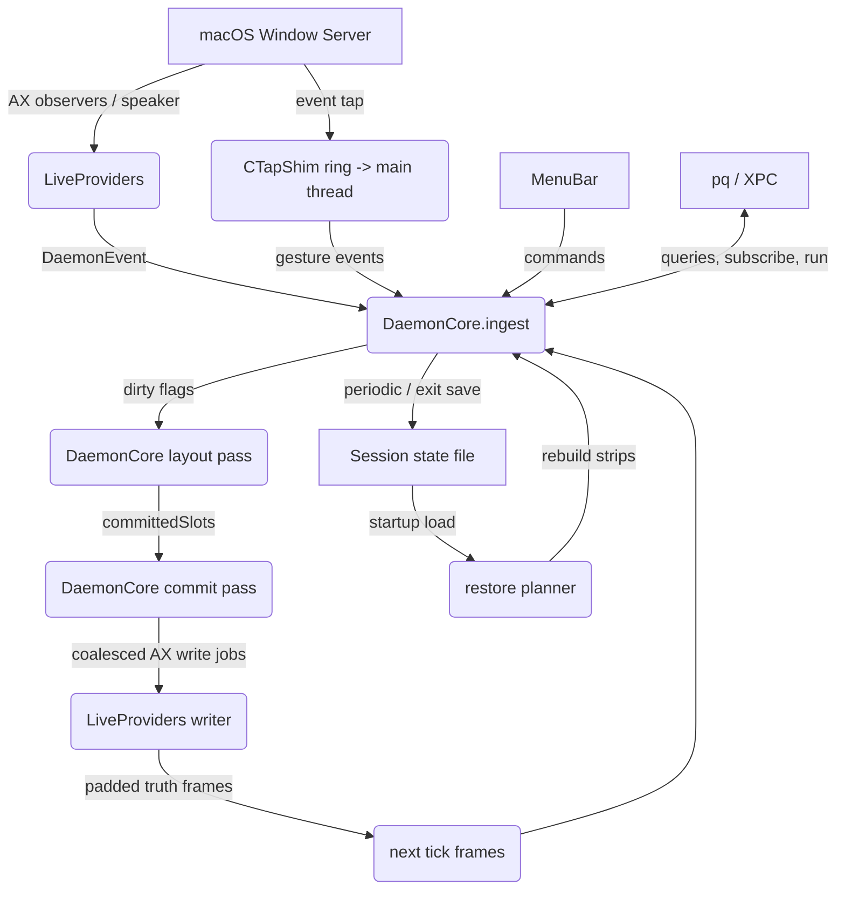

# Paneru Architecture

This document provides a high-level overview of Paneru's architecture for
contributors. Paneru is a macOS window manager implemented as a native
**Swift daemon** (`swift-daemon/`, product `paneru-swift`). The earlier
Bevy/ECS Rust daemon was removed from the tree; its trace corpus was frozen
and is replayed by `FrameParityChecks` as the layout-regression gate.

## 1. High-Level Overview

Paneru manages macOS windows as a **sliding strip** (inspired by Niri and
PaperWM). The core design is a **pure core + main-thread host seam**: window
state and layout math live in value-type modules with no AppKit, while all
macOS exposure (AX reads/writes, the event tap, presenter, menu bar, XPC)
runs on the main thread behind small protocol seams.

- **Serial assembly:** `DaemonCore` runs `ingest → layout → commit → paint`
  per 60Hz tick against injected frame providers and per-workspace viewports.
- **Deterministic passes:** every mutation sets an explicit dirty flag;
  there is no emergent `Changed`/`Added` scheduling.
- **Idle when static:** a settled world holds no flight markers, scroll
  state, held gestures, or eased drives — quiet frames do no work.
- **Slots always abut:** between-window gaps live entirely in the host AX
  layer as per-window padding insets; the core holds no gap state.

## 2. The macOS Bridge

### Event Ingestion (macOS → core)
1. **LiveProviders** (`Sources/LiveProviders/`): AX observers, the HID
   event tap (`LiveTap.swift` via the `CTapShim` C sidecar), and window
   roster sync deliver native events.
2. **Tap shim:** a real-time `CGEventTap` in C (SPSC ring + translator +
   callback) drains on the main thread.
3. **`PaneruDaemon/main.swift`** turns roster/observer/tap events into
   `DaemonEvent`s and appends them to the ingest queue.

### State Synchronization (core → macOS)
1. **Passes** compute intended window positions and sizes from the tiling
   logic; `committedSlots` are the model truth.
2. **`DaemonCore`** enqueues coalesced AX write jobs (latest-per-window
   merge, epoch-ordered).
3. **`LiveProviders`** applies the writes (padding-aware), and reads expand
   back out to padded truth on the next frame.

**Main-Thread Confinement:** all AppKit/Accessibility/CoreGraphics calls run
on the main thread. Plain `Send` data crosses to the AX worker and the Lua
worker; the Swift 6 concurrency checker is satisfied structurally.

### The Lua Worker

The embedded scripting runtime (vendored PUC-Rio 5.5) runs on its own
thread — a handler is user code of unbounded duration and must never stall
the tick. Every message to the worker carries the frame's `BatchSnapshot`,
which handlers read synchronously; only script-state *writes* round-trip for
their ack. Anything crossing that boundary is plain `Send` data, never a Lua
value.

## 3. Module Map (`swift-daemon/Sources/`)

| Module | Responsibility |
| :--- | :--- |
| `Geometry` | Pure rect math: `round_px`, viewport clamps, `origin_exposing`, CG↔Cocoa conversion, border rects, drop-preview rects. |
| `Layout` | ECS-free `LayoutStrip`/`Column`/`StackItem` model, `binpackHeights`/`mostVisibleWindow`. |
| `Focus` | Same-strip stepping, edge entry, focus history tiers. |
| `Animation`/`Scroll` | Tween math, burst phases, swipe physics, snap targets, settle guard, viewport clamp. Single internal pacing (250/80/320); a plain `animations` toggle. |
| `Session` | Codable state model with version gate + restore planner. |
| `Config` | Resolved defaults/clamps/hex parsing, TOML + Lua `paneru.setup` decode, `[bindings]`/`[windows.*]` tables. |
| `Commands` | Full command vocabulary + argv encoding. |
| `Workspace` | Virtual-switch index resolution, FocusOrVirtual contract. |
| `EventCore` | Lexical pass order, `DirtyFlags`, pump cadence, scheduling predicates. |
| `StateQuery`/`WindowSet`/`Scripting`/`LuaBridge`/`LuaAPI`/`ScriptHost` | Script-facing state, window-set ops, script store, Lua bridge, query client, worker mailbox. |
| `IPC`/`PaneruXPC` | Codable protocol shapes and the XPC transport (Mach service `com.github.iv-lite.paneru-swift`, `PANERU_MACH_SERVICE` override). |
| `Service`/`RenderPlist` | launchd agent model and plist rendering (label `com.github.iv-lite.paneru-swift`). |
| `Displays` | Display identity, dock location, menubar/notch rules, viewport derivation, workspace mapping. |
| `Presenter` | Borders, dim, flash, drop preview — AppKit-free decisions, main-thread live managers. |
| `MenuBar` | Indicator labels, width normalization, enablement, live `NSStatusItem`. |
| `LiveProviders` | AX reads/writes/observers, tap, writer coalescing, launchctl/XPC shells. |
| `PaneruDaemon` | The runnable binary: grant check, roster, observers, tap, 60Hz tick, job application, XPC, Lua host loop. |
| `PqQueryTool` | `pq`: CLI queries and `pq run <argv>` commands/`subscribe` over XPC. |

## 4. Key Data Models

- **`WindowID` / `WindowMetadata`:** window identity and app/bundle/title
  metadata (from the host roster).
- **`LayoutStrip`:** per-workspace, per-virtual-row ordered list of
  `Column`s (`.single`, `.stack`, `.tabs`, `.fullscreen`).
- **`CommittedSlots` / `positions`:** the model-truth frames; live glass is
  padded truth and chases the model, never the reverse.
- **`offsets` / `offsetTargets`:** strip scroll (per workspace), eased
  through the shared burst clock.
- **`activeWorkspace` / `activeVirtual`:** the active display's workspace
  and the chosen virtual row.
- **`spaceStash` / `parkedRows`:** long- and short-term memory for windows
  that vanish onto inactive Spaces or minimize.

## 5. Architectural Invariants

- **Main thread only:** any AppKit/CoreGraphics/AX interaction happens on
  the main thread.
- **Core = source of truth:** the physical window state reflects the core
  (`committedSlots`), never the reverse.
- **Pure layout:** the core's layout math operates on coordinates and
  ratios, never OS calls.
- **Bounded restore:** saved session state is consulted only during the
  startup grace period; after it expires, config and window rules own new
  windows.
- **Idle when static:** quiet frames do no work — no flight markers, scroll
  state, held gestures, animating drives, or homing graces (the quiescence
  invariant, by construction via explicit dirty flags).
- **Tabs never reveal:** tabbed members are skipped by `revealFocus` and
  `applyPendingCenters`, and native-tab grouping collapses same-app
  same-frame siblings so a background tab never holds a show-nothing slot.
- **New apps open under the cursor:** a fresh spawn lands on the display
  under the cursor and activates it; space-return restores never steal the
  active workspace.
- **Mouse-follows-focus is keyboard/raise-only:** ambient arrivals never
  move the pointer.
- **One animation toggle:** timing is internal and shared across movement,
  resize, and strip translation.

## 6. Session Restore

`Sources/Session/Session.swift` encodes the restart snapshot (layout
strips, virtual workspace rows, display assignments) atomically to
`paneru/state.json` in the XDG state directory. Startup restore keeps the
loaded state alive for the configured grace period; as windows arrive, a
restore plan matches them to the saved session (stable identity first,
fallback geometry matching second), rebuilding strip structure. Windows
missing at startup are ignored by default and the layout compacts around
the matched survivors; unmatched and post-grace windows follow normal
config behavior.

## 7. Data Flow

## 8. Verification: the frozen parity corpus

`FrameParityChecks` (`Tests/FrameParityChecks`) replays **frozen Rust-truth
corpora** — `Tests/FrameParityChecks/corpus/*.jsonl` — through `DaemonCore`
and diffs the rest state (settle drain, one tick per command window,
`MenuOpened` → focus, x-only positions). The corpus is committed and
requires no Rust interpreter; it fails, never skips, without one. A layout
change that intentionally diverges must update the corpus deliberately.
New geometry needs both directions pinned (wrap, seams, steps).

`scripts/verify-swift.sh` is the single verification gate: the full-product
**release** build with zero errors and zero warnings (census the whole log —
debug builds once hid 58 warnings), every `*Checks` runner, then the parity
replay.

### Host proving runbook (permissioned Mac)

1. `swift-daemon/install-service.sh install` (or `swift build
   --package-path swift-daemon --product paneru-swift` to run by hand).
2. Grant Accessibility (the daemon exits loudly without it), then verify
   each live seam: AX reads/writes (`LiveProviders/LiveAX.swift`), tap
   install + gestures (`LiveTap.swift`), borders/dim/flash/drop
   (`Presenter/`), menubar (`MenuBar/MenuBar.swift`), XPC query/subscribe
   round trips, and Lua binds/handlers from your `init.lua`.
3. Keep `FrameParityChecks` green on every layout-affecting change.

## 9. Testing Strategy

1.  **Pure Unit Checks:** each pure module ships its own `*Checks` runner
    (`GeometryChecks`, `LayoutChecks`, `AnimationChecks`, `ScrollChecks`,
    `ConfigChecks`, `FocusChecks`, …) — no macOS environment needed.
2.  **DaemonChecks Integration Tests:** fixed mock frames → `tick` → assert
    `positions`/`offsets`/`offsetTarget`/`axJobs`/`committedSlot`; drain
    with empty ticks for glide settle; snap with `animationsEnabled=false`
    for exact rest asserts.
3.  **Frame Parity:** `FrameParityChecks` replays the frozen corpus (see
    §8).
4.  **FFI / Live Verification:** manual or semi-automated on a real Mac for
    the permissioned AX/tap seams.
5.  **Agent Support:** `AGENTS.md` provides project-specific guidance for AI
    agents, including the `verify-swift.sh` gate.